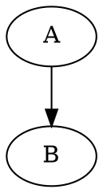

# Graphviz DOT Diagram Syntax Reference

## Overview

Write syntactically valid Graphviz DOT language for any diagram type. Key principle: separate node IDs from display labels, and understand when to use records vs HTML labels.

## Graph Types



**Never mix `->` and `--`** -- use `->` in digraph, `--` in graph.

## Node Shapes

| Shape | Use For | Syntax |
|-------|---------|--------|
| `box` | Actions, steps | `[shape=box]` |
| `diamond` | Decisions | `[shape=diamond]` |
| `ellipse` | States (default) | `[shape=ellipse]` |
| `record` | Structured data with fields | `[shape=record]` |
| `Mrecord` | Record with rounded corners | `[shape=Mrecord]` |
| `doublecircle` | Start/end states | `[shape=doublecircle]` |
| `octagon` | Warnings | `[shape=octagon]` |
| `plaintext` | Commands, no border | `[shape=plaintext]` |
| `box3d` | Servers, 3D objects | `[shape=box3d]` |
| `none` | Invisible node | `[shape=none]` (use with HTML labels) |

## Critical: Node IDs vs Labels

**Always use simple IDs, put display text in labels:**

```dot
// CORRECT: simple ID, complex label
build_pkg [label="Build & Package (v2.0)"]
db_primary [label="DB:Primary"]
my_server [label="Server\nMulti-line"]

// WRONG: special chars in ID cause parsing issues
"Build & Package (v2.0)" -> next   // & may break in some contexts
"DB:Primary" -> "DB:Replica"       // colon triggers port parsing
```

**Colons in IDs are ports:** `node:port` is Graphviz port syntax. Never use colons in node names. Use `db_primary [label="DB:Primary"]` instead.

## Record Nodes with Ports

Records use `|` to separate fields and `<port>` for connection points:

```dot
// CORRECT: ports defined with <name> in label
node [shape=record]
users  [label="{Users|<id> id [PK]: int|<name> name: varchar|<email> email: varchar}"]
orders [label="{Orders|<id> id [PK]: int|<uid> user_id [FK]: int|total: decimal}"]

users:id -> orders:uid   // connects to the specific field
```

```dot
// WRONG: no <port> markers -- port references won't work
orders [label="{Orders|id [PK]: int|user_id [FK]: int}"]
users:id -> orders:user_id   // FAILS: "user_id" port doesn't exist
```

**Rule:** If you will connect edges to specific fields, you MUST define `<port_name>` inside the record label.

## HTML-Like Labels

For rich formatting, use `< >` delimiters (not quotes):

```dot
node [shape=none]  // shape=none or shape=plaintext for HTML labels
users [label=<
  <TABLE BORDER="1" CELLBORDER="1" CELLSPACING="0">
    <TR><TD COLSPAN="2"><B>Users</B></TD></TR>
    <TR><TD PORT="id">id [PK]</TD><TD>int</TD></TR>
    <TR><TD PORT="name">name</TD><TD>varchar</TD></TR>
  </TABLE>
>]
```

**HTML labels:** Use `PORT="name"` (attribute) for connection points. Escape `&` as `&amp;`, `<` as `&lt;`, `>` as `&gt;` inside HTML content.

**Never mix** record syntax (`{...|...}`) with HTML labels (`<TABLE>`) on the same node.

## Subgraph Clusters

```dot
subgraph cluster_name {   // MUST start with "cluster_"
    label = "Cluster Label"
    style = filled
    fillcolor = lightblue
    // nodes here
}
```

**The prefix `cluster_` is required** for the subgraph to render as a box. Without it, Graphviz treats it as a logical grouping only.

## Edges and Styling

```dot
A -> B [label="yes", color=green]
A -> B [style=dashed]                  // dashed, dotted, bold, invis
A -> B [penwidth=2.5]                  // line thickness
A -> B [weight=10]                     // layout hint (higher = straighter)
A -> B [dir=both]                      // bidirectional arrow (digraph only)
A -> B [arrowhead=vee, arrowtail=dot]  // arrow styles
```

## Global Attributes


**rankdir:** `TB` (top-bottom, default), `LR` (left-right), `BT`, `RL`

## Common Mistakes

| Mistake | Fix |
|---------|-----|
| `->` in undirected `graph` | Use `--` for `graph`, `->` for `digraph` |
| Colons in node IDs (`"DB:Primary"`) | Use ID without colon: `db_primary [label="DB:Primary"]` |
| Record ports without `<name>` markers | Add `<port>` in label: `{Table\|<id> id: int}` |
| `&` in HTML label not escaped | Use `&amp;` inside `< >` labels |
| `subgraph name` without `cluster_` prefix | Use `subgraph cluster_name` for visible boxes |
| Mixing record `{..}` and HTML `<TABLE>` | Choose one per node -- don't mix |
| `shape=record` with HTML label | Use `shape=none` or `shape=plaintext` for HTML labels |

## Rendering to SVG

Use `render-dot-to-svg.js` (in this skill directory) to convert `.dot` files to SVG:

```bash
node render-dot-to-svg.js <input.dot> [output.svg]
```

- Uses the quickchart.io/graphviz API (no local Graphviz install needed)
- Output defaults to `<input>.svg` if omitted
- Sends DOT source as JSON POST request

## Validation Checklist

Before outputting DOT code, verify:
- [ ] `digraph` uses `->`, `graph` uses `--`
- [ ] No colons in node IDs (colons only for port references)
- [ ] Record nodes: every port referenced in edges has `<port>` in label
- [ ] HTML labels: `&` escaped as `&amp;`, shape is `none` or `plaintext`
- [ ] Cluster subgraphs start with `cluster_` prefix
- [ ] No mixed record + HTML syntax on same node
