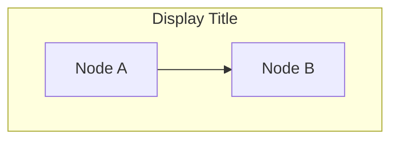
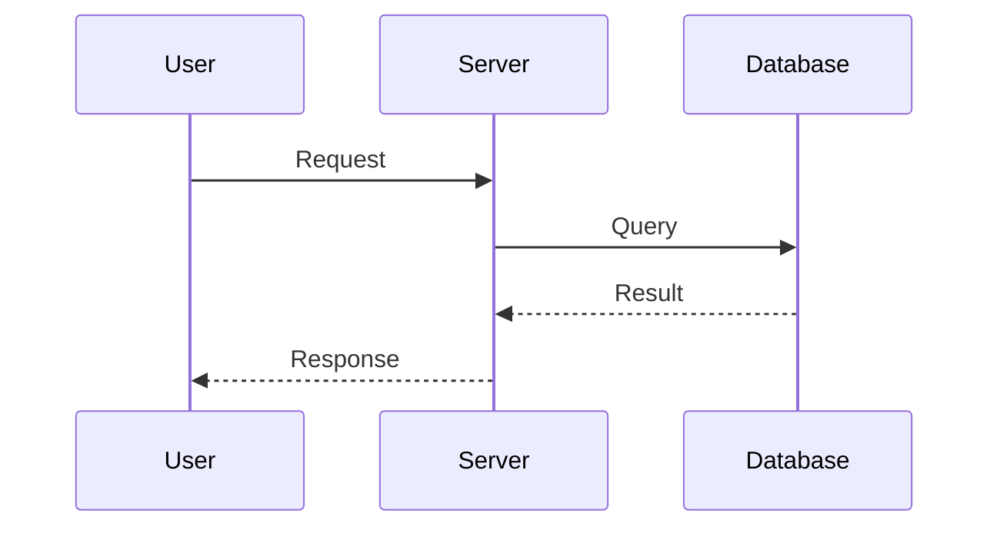
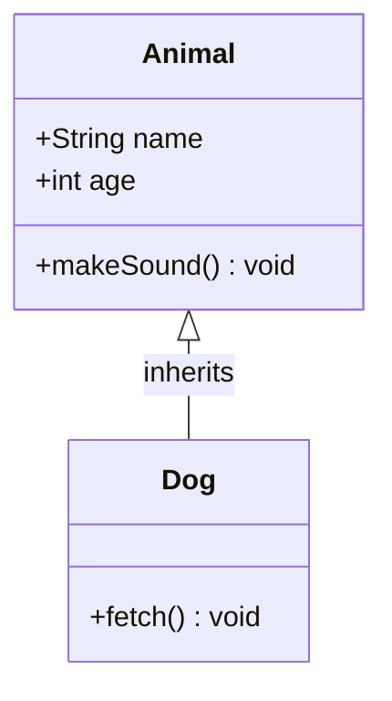
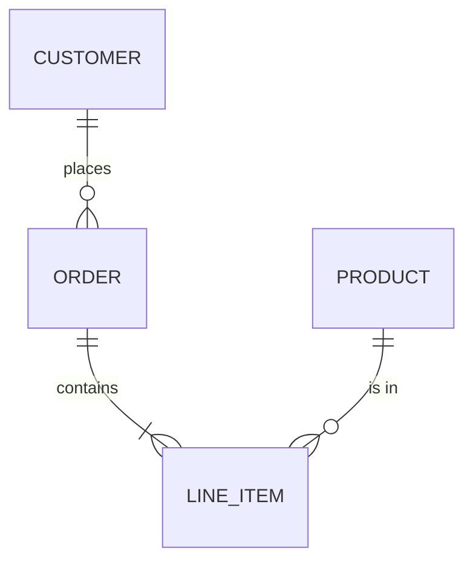
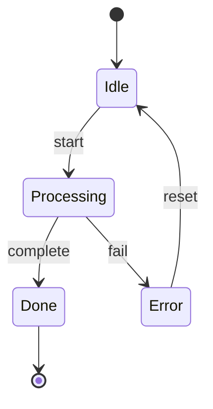
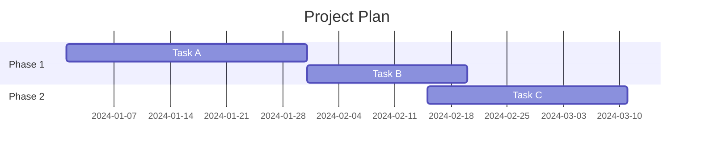
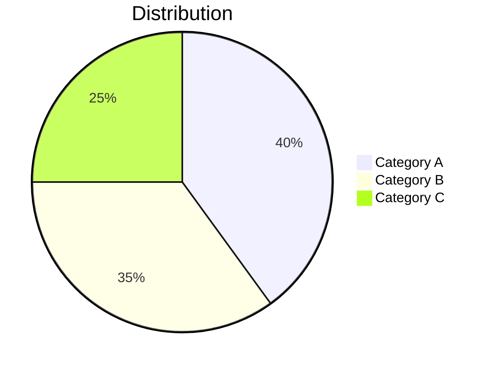
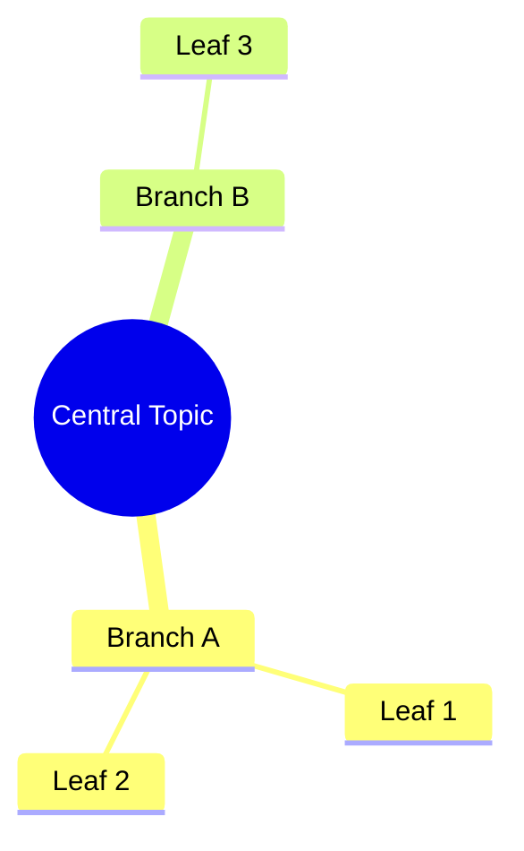

# Mermaid Diagram Syntax Reference

## Overview

Create syntactically valid Mermaid diagrams. Mermaid is sensitive to whitespace, quoting, and reserved words. This reference prevents the most common generation errors.

## Supported Diagram Types

| Type | Keyword | Use For |
|------|---------|---------|
| Flowchart | `flowchart TD` | Processes, decisions, workflows |
| Sequence | `sequenceDiagram` | API calls, message flows |
| Class | `classDiagram` | OOP structures, relationships |
| State | `stateDiagram-v2` | State machines, lifecycles |
| ER | `erDiagram` | Database schemas, entity relationships |
| Gantt | `gantt` | Project timelines, schedules |
| Pie | `pie` | Proportional data |
| Mindmap | `mindmap` | Brainstorming, topic hierarchies |
| Timeline | `timeline` | Chronological events |
| Git Graph | `gitGraph` | Branch/merge visualization |

## Critical Syntax Rules

### 1. Quote Node Labels With Special Characters

```mermaid
%% BAD - will break
flowchart TD
    A[User's Input] --> B[Check (valid)]

%% GOOD - quoted labels
flowchart TD
    A["User's Input"] --> B["Check (valid)"]
```

**Always quote labels** containing: `'`, `"`, `(`, `)`, `[`, `]`, `{`, `}`, `&`, `<`, `>`, `#`, or any non-alphanumeric characters beyond spaces and hyphens.

### 2. Node IDs Must Be Simple

Node IDs (the part before brackets) must contain only letters, numbers, and underscores. No spaces, hyphens, or special characters in IDs.

```mermaid
%% BAD
flowchart TD
    user-input[Input] --> check-valid[Check]

%% GOOD
flowchart TD
    userInput[Input] --> checkValid[Check]
```

### 3. Subgraph Syntax



- Always quote the subgraph display title
- Use `end` to close (not `endsubgraph`)
- Define edges AFTER subgraph blocks when connecting across subgraphs

### 4. Sequence Diagram Participants



- Declare participants before messages
- Use `->>` for solid arrows, `-->>` for dashed
- Note syntax: `Note right of S: Processing`
- `Note over U,S: Shared note` for spanning notes

### 5. Class Diagram Syntax



- Use `<|--` for inheritance, `*--` for composition, `o--` for aggregation
- Methods: `+public`, `-private`, `#protected`

### 6. ER Diagram Syntax



- Entity names: UPPER_CASE, no spaces
- Relationship labels: quote if multi-word
- Cardinality: `||` exactly one, `o{` zero or more, `|{` one or more, `o|` zero or one

### 7. State Diagram



- Use `stateDiagram-v2` (not v1)
- `[*]` for start/end states
- Transition labels after colon
- **Quote reserved words** used as state names: `"default"`, `"end"`, `"class"`, `"graph"`, `"style"`, `"subgraph"`

### 8. Gantt Chart



- Always include `dateFormat`
- Task IDs enable `after` dependencies
- Duration: `30d` (days), `2w` (weeks)

### 9. Pie Chart



- Always quote category labels
- Values are raw numbers (not percentages)

### 10. Mindmap



- Indentation defines hierarchy (use consistent spaces)
- Root shapes: `((circle))`, `[square]`, `(rounded)`

## Common Mistakes

| Mistake | Fix |
|---------|-----|
| Unquoted special chars in labels | Wrap label in double quotes |
| Hyphens in node IDs | Use camelCase or underscores |
| Missing `end` after subgraph | Always close with `end` |
| Using `graph` instead of `flowchart` | Use `flowchart` for modern syntax |
| Edges inside subgraph referencing external nodes | Move cross-subgraph edges outside |
| Forgetting `dateFormat` in gantt | Always include it |
| Spaces in ER entity names | Use UPPER_SNAKE_CASE |
| Using `stateDiagram` v1 | Use `stateDiagram-v2` |
| Semicolons at end of lines | Mermaid doesn't need semicolons |
| `Note` placement in sequence diagrams | Must be `right of`, `left of`, or `over` |

## Rendering to SVG

Use `render-mermaid-to-svg.js` (in this skill directory) to convert `.mmd` files to SVG:

```bash
node render-mermaid-to-svg.js <input.mmd> [output.svg]
```

- Uses the mermaid.ink API (no local install needed)
- Output defaults to `<input>.svg` if omitted
- Encodes diagram as pako-deflated base64url JSON

## Validation Checklist

Before finalizing any diagram:

1. All node IDs use only letters, numbers, underscores
2. All labels with special characters are quoted
3. Subgraphs are closed with `end`
4. Diagram type keyword is correct and current
5. No reserved words used as unquoted node IDs (`end`, `graph`, `subgraph`, `style`, `class`, `click`, `default`)
6. Direction specified for flowcharts (`TD`, `LR`, `BT`, `RL`)

## Output Format

When creating Mermaid diagrams:

1. Output the diagram inside a ` ```mermaid ` fenced code block
2. Add a brief text description above the diagram explaining what it shows
3. If the diagram is complex, break it into multiple smaller diagrams rather than one massive chart
