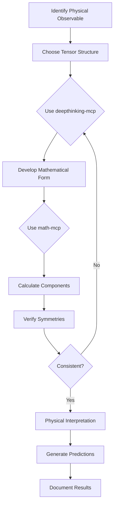
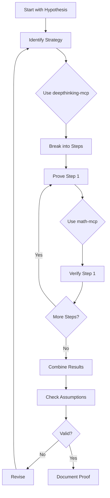

# Universal Tensor Physics Framework - Research Skill

## Overview

This skill provides systematic methodologies for conducting theoretical physics research on the Universal Tensor Physics Framework (UPTF), with specific emphasis on:

1. **Bridge Equations**: Connecting physical reality (atoms) to mathematical foundations (axioms)
2. **Tensor Formalism**: Rigorous mathematical structures underlying physical phenomena
3. **Proof Development**: Step-by-step derivation and verification of theoretical results
4. **Integration with MCP Tools**: Leveraging deepthinking-mcp for reasoning and math-mcp for calculations

## Core Research Philosophy

### The UPTF Paradigm

The Universal Tensor Physics Framework distinguishes between:
- **The Physical** (atoms): Observable reality, experimental data, physical systems
- **The Virtual** (axioms): Mathematical structures, logical frameworks, theoretical constructs

**Central Thesis**: A unified tensor framework can bridge these domains, providing:
- Rigorous mathematical foundations for physical theories
- Predictive power from first principles
- Unification of disparate physical phenomena

### Research Methodology

```
1. FORMULATION
   ├─ Define the problem in tensor notation
   ├─ Identify relevant symmetries and conservation laws
   └─ Establish boundary conditions and constraints

2. MATHEMATICAL DEVELOPMENT
   ├─ Use deepthinking-mcp for conceptual breakthroughs
   ├─ Use math-mcp for rigorous calculations
   └─ Develop formal proofs step-by-step

3. PHYSICAL INTERPRETATION
   ├─ Map mathematical results back to physical observables
   ├─ Verify consistency with known physics
   └─ Generate testable predictions

4. VALIDATION
   ├─ Check mathematical consistency
   ├─ Verify dimensional analysis
   ├─ Compare with experimental data where available
   └─ Document assumptions and limitations
```

## Working with MCP Tools

### deepthinking-mcp Integration

Use for:
- **Conceptual Breakthroughs**: "How can we represent quantum entanglement in pure tensor form?"
- **Problem Decomposition**: Breaking complex proofs into manageable steps
- **Symmetry Analysis**: Identifying hidden symmetries in tensor structures
- **Bridge Reasoning**: Connecting mathematical formalism to physical intuition

Example usage pattern:
```python
# When stuck on a conceptual problem
query = """
In the Universal Tensor Physics Framework, we need to derive a bridge equation
connecting the stress-energy tensor T_μν to the curvature tensor R_μν.
What are the key symmetries we should preserve, and what intermediate steps
should we take?
"""
# Let deepthinking-mcp explore the conceptual space
```

### math-mcp Integration

Use for:
- **Tensor Calculations**: Contractions, transformations, decompositions
- **Numerical Verification**: Checking analytical results
- **Matrix Operations**: Eigenvalues, determinants, traces
- **Statistical Analysis**: When working with data or distributions

Example usage pattern:
```python
# For rigorous calculation
# Calculate the Ricci tensor contraction
R = contract_tensor(R_μν_ρσ, [(1,2)])  # math-mcp handles this

# Verify the Bianchi identity
nabla_μ_R_μν = covariant_derivative(R_μν, μ)
assert norm(nabla_μ_R_μν) < epsilon  # Should be zero
```

## Tensor Notation Standards

### Index Convention

- **Greek indices** (μ, ν, ρ, σ): Spacetime indices (0,1,2,3)
- **Latin indices** (i, j, k, l): Spatial indices (1,2,3)
- **Uppercase** (A, B, C): Abstract tensor spaces
- **Lowercase** (a, b, c): Component indices

### Einstein Summation Convention

Repeated indices are summed:
```
A^μ B_μ = Σ_μ A^μ B_μ
```

### Tensor Operations

**Contraction**:
```
C^μ_ν = A^μ_ρ B^ρ_ν
```

**Covariant Derivative**:
```
∇_μ V^ν = ∂_μ V^ν + Γ^ν_μρ V^ρ
```

**Lie Derivative**:
```
£_X T^μ_ν = X^ρ ∂_ρ T^μ_ν - T^ρ_ν ∂_ρ X^μ + T^μ_ρ ∂_ν X^ρ
```

## Bridge Equation Development

### Framework for Bridge Equations

A bridge equation connects physical observables to mathematical structures:

```
Physical Domain  ←→  Mathematical Domain
    (atoms)              (axioms)
       ↓                    ↓
   Observable         Tensor Structure
       ↓                    ↓
   Measurement  ←→  Component Values
```

### Template for Bridge Equation Derivation

```markdown
## Bridge Equation: [Physical Quantity] ↔ [Tensor Structure]

### 1. Physical Specification
- **Observable**: [What we measure]
- **Domain**: [Where/when this applies]
- **Symmetries**: [Physical conservation laws]
- **Units**: [Dimensional analysis]

### 2. Mathematical Structure
- **Tensor Type**: [Rank, symmetries, properties]
- **Coordinate System**: [Choice and justification]
- **Transformation Properties**: [Under Lorentz, gauge, etc.]

### 3. Bridge Relation
- **Formal Expression**: [The equation]
- **Component Form**: [Explicit components]
- **Constraints**: [Mathematical conditions]

### 4. Derivation Steps
[Use deepthinking-mcp for strategy]
[Use math-mcp for calculations]

Step 1: [Starting point]
Step 2: [First transformation]
...
Step n: [Final result]

### 5. Verification
- [ ] Mathematical consistency
- [ ] Dimensional correctness
- [ ] Symmetry preservation
- [ ] Physical interpretation
- [ ] Known limits/special cases

### 6. Physical Predictions
- **Testable Predictions**: [What this implies]
- **Experimental Signatures**: [How to verify]
- **Range of Validity**: [Where this holds]
```

## Common Research Patterns

### Pattern 1: Symmetry-Based Derivation

When deriving equations based on symmetry principles:

1. **Identify Symmetries**: Use Noether's theorem framework
2. **Write Most General Form**: Consistent with symmetries
3. **Apply Constraints**: Physical requirements, boundary conditions
4. **Simplify**: Using math-mcp for tensor algebra
5. **Verify**: Check all symmetries are preserved

```python
# Example workflow
symmetries = identify_symmetries(system)
general_tensor = construct_most_general_tensor(rank, symmetries)
constrained = apply_physical_constraints(general_tensor)
simplified = simplify_tensor(constrained)  # math-mcp
verify_symmetries(simplified, symmetries)
```

### Pattern 2: Variational Derivation

For Lagrangian/Hamiltonian formulations:

1. **Write Action**: S = ∫ L d⁴x
2. **Vary the Action**: δS = 0
3. **Derive Equations of Motion**: Euler-Lagrange equations
4. **Identify Conserved Quantities**: Noether currents
5. **Express in Tensor Form**: Covariant formulation

```python
# Workflow with MCP integration
lagrangian = construct_lagrangian(fields, metric)
action = integrate(lagrangian, spacetime)
variation = vary_action(action, fields)  # deepthinking-mcp helps here
equations_of_motion = euler_lagrange(variation)  # math-mcp computes
conserved_currents = noether_theorem(symmetries, lagrangian)
tensor_form = covariantize(equations_of_motion)
```

### Pattern 3: Perturbative Expansion

When exact solutions are intractable:

1. **Identify Small Parameter**: ε << 1
2. **Expand in Powers**: T = T₀ + εT₁ + ε²T₂ + ...
3. **Solve Order by Order**: Using math-mcp
4. **Check Convergence**: Verify series makes sense
5. **Physical Interpretation**: What each order represents

### Pattern 4: Dimensional Analysis

Always verify dimensional consistency:

```python
def check_dimensions(equation):
    """
    Verify all terms have same dimensions
    """
    left_side = get_dimensions(equation.lhs)
    right_side = get_dimensions(equation.rhs)
    
    assert left_side == right_side, f"Dimension mismatch: {left_side} ≠ {right_side}"
    
    # Check each term in sums
    for term in equation.terms:
        assert get_dimensions(term) == left_side
```

## Proof Development Strategy

### Step-by-Step Proof Construction

Use this checklist when developing proofs:

**Phase 1: Understanding**
- [ ] Clearly state what needs to be proven
- [ ] Identify all assumptions and givens
- [ ] Understand physical context and motivation
- [ ] Use deepthinking-mcp to explore the problem space

**Phase 2: Strategy**
- [ ] Determine proof approach (direct, contradiction, induction, etc.)
- [ ] Identify key intermediate results needed
- [ ] Break into subproblems
- [ ] Map out logical dependency structure

**Phase 3: Execution**
- [ ] Start from established results or axioms
- [ ] Proceed step-by-step with clear justification
- [ ] Use math-mcp for calculations at each step
- [ ] Verify each intermediate result

**Phase 4: Verification**
- [ ] Check mathematical rigor
- [ ] Verify all assumptions were used appropriately
- [ ] Confirm no logical gaps
- [ ] Test special cases and limits
- [ ] Physical sanity checks

**Phase 5: Documentation**
- [ ] Write clearly with proper notation
- [ ] Include physical interpretation
- [ ] Note range of validity
- [ ] Acknowledge limitations
- [ ] Suggest extensions or open questions

### Example: Proving a Bridge Equation

```markdown
## Proof: Energy-Momentum Conservation from Tensor Symmetry

**Theorem**: In a spacetime with metric g_μν, if the stress-energy tensor
T^μν satisfies certain symmetry properties, then ∇_μ T^μν = 0.

**Given**:
- Metric tensor g_μν with signature (-,+,+,+)
- Stress-energy tensor T^μν (symmetric, rank-2)
- Covariant derivative ∇_μ

**To Prove**: ∇_μ T^μν = 0 (energy-momentum conservation)

**Strategy** [deepthinking-mcp helps determine approach]:
1. Use the Bianchi identity on Riemann tensor
2. Connect to Einstein field equations
3. Show contracted Bianchi identity implies our result

**Proof**:

Step 1: Start with Bianchi identity
```
∇_[ρ R_σμ]νκ = 0
```

Step 2: Contract on appropriate indices [math-mcp calculation]
```python
# Contract to get Ricci tensor relation
result = contract_bianchi_identity()
# yields: ∇^μ R_μν - (1/2) ∇_ν R = 0
```

Step 3: Apply Einstein field equations
```
G_μν = R_μν - (1/2) g_μν R = 8πG T_μν
```

Step 4: Take covariant derivative [math-mcp]
```python
# ∇^μ G_μν = 8πG ∇^μ T_μν
nabla_G = covariant_derivative(G_μν)
# From Step 2, we know nabla_G = 0
```

Step 5: Conclude
```
∇^μ G_μν = 0  ⟹  ∇^μ T_μν = 0  ∎
```

**Physical Interpretation**:
- Energy is conserved locally
- Momentum is conserved locally
- This is a consequence of diffeomorphism invariance
- Holds in any coordinate system

**Verification**:
- [✓] Dimensions check (∇^μ T_μν has units of energy density/length)
- [✓] Transforms as a vector under coordinate changes
- [✓] Reduces to special relativity in flat space
- [✓] Consistent with Noether's theorem
```

## Research Documentation Standards

### Equation Labeling

Label all important equations for reference:

```markdown
The Einstein field equations are:

$$G_μν + Λg_μν = 8πG T_μν \tag{EFE}$$

From (EFE), we can derive...
```

### Notation Declaration

Always declare notation at the beginning:

```markdown
## Notation

- **Metric**: g_μν with signature (-,+,+,+)
- **Christoffel symbols**: Γ^μ_νρ = (1/2) g^μσ (∂_ν g_σρ + ∂_ρ g_νσ - ∂_σ g_νρ)
- **Riemann curvature**: R^ρ_σμν = ∂_μ Γ^ρ_νσ - ∂_ν Γ^ρ_μσ + Γ^ρ_μλ Γ^λ_νσ - Γ^ρ_νλ Γ^λ_μσ
- **Natural units**: c = ℏ = 1
- **Indices**: μ,ν,ρ,σ ∈ {0,1,2,3}
```

### Assumption Tracking

Keep track of all assumptions:

```markdown
## Assumptions

1. **Spacetime Structure**:
   - Manifold is smooth and differentiable
   - Topology is R × Σ (globally hyperbolic)
   - Metric signature is Lorentzian

2. **Field Properties**:
   - Fields are classical (no quantum corrections)
   - Energy conditions: T_μν u^μ u^ν ≥ 0 for all timelike u^μ
   - Asymptotically flat at spatial infinity

3. **Mathematical**:
   - All tensors are smooth (C^∞)
   - Summations converge appropriately
   - Coordinate charts are well-defined
```

## Problem-Solving Workflows

### Workflow 1: New Bridge Equation



### Workflow 2: Proof Verification



### Workflow 3: Numerical Validation

When analytical solutions are difficult:

1. **Discretize** the problem (finite difference, finite element)
2. **Implement** in code with math-mcp
3. **Solve** numerically
4. **Compare** with analytical approximations
5. **Verify** convergence properties
6. **Visualize** results

## Advanced Techniques

### Tensor Decomposition

Break complex tensors into simpler components:

```python
# Decompose a rank-4 tensor
def decompose_tensor(T_abcd):
    """
    Decompose T_abcd = S_abcd + A_abcd + ...
    where S is symmetric, A is antisymmetric, etc.
    """
    # Use math-mcp for the calculation
    symmetric = symmetrize(T_abcd)
    antisymmetric = antisymmetrize(T_abcd)
    
    # Verify decomposition
    assert norm(T_abcd - symmetric - antisymmetric) < epsilon
    
    return symmetric, antisymmetric
```

### Coordinate-Free Formulation

Express results without coordinates when possible:

```markdown
Instead of: ∂_μ A^μ = 0

Write: d⋆F = 0 (where F is the field strength 2-form)

This makes gauge invariance manifest.
```

### Effective Field Theory Approach

When working at different energy scales:

1. **Identify Energy Scale**: E_typical
2. **Integrate Out Heavy Modes**: E > E_cutoff
3. **Write Effective Lagrangian**: In terms of light fields
4. **Match to Full Theory**: At boundary
5. **Compute Corrections**: Order by order in E/E_cutoff

## Integration with Existing Tools

### Using deepthinking-mcp Effectively

**For conceptual problems**:
```
"In UPTF, how do we ensure that our tensor formulation respects
both quantum mechanical principles and general relativistic covariance?
What are the key consistency conditions?"
```

**For proof strategy**:
```
"I need to prove that [statement]. What are three different approaches
I could take, and what are the pros/cons of each?"
```

**For physical intuition**:
```
"This mathematical result [equation] seems abstract. What physical
phenomenon does this correspond to, and can you provide an analogy?"
```

### Using math-mcp Effectively

**For tensor calculations**:
```python
# Contract indices
result = contract_indices(tensor, [(0,2), (1,3)])

# Compute Christoffel symbols
gamma = christoffel_symbols(metric)

# Verify identity
lhs = compute_lhs(equation)
rhs = compute_rhs(equation)
assert np.allclose(lhs, rhs), "Identity failed"
```

**For numerical work**:
```python
# Solve eigenvalue problem
eigenvalues, eigenvectors = solve_eigenvalue_problem(matrix)

# Compute determinant
det = determinant(metric)

# Numerical integration
result = numerical_integral(integrand, bounds)
```

## Common Pitfalls and Solutions

### Pitfall 1: Index Confusion

**Problem**: Mixing covariant and contravariant indices incorrectly

**Solution**: 
- Use explicit notation: always mark raised (^μ) vs lowered (_μ)
- Verify with math-mcp: check all contractions
- Use index-free notation when possible

### Pitfall 2: Coordinate Artifacts

**Problem**: Results that depend on coordinate choice

**Solution**:
- Express in manifestly covariant form
- Check multiple coordinate systems
- Use deepthinking-mcp to identify gauge freedom

### Pitfall 3: Dimension Errors

**Problem**: Terms with mismatched dimensions

**Solution**:
```python
def dimensional_analysis(equation):
    """Always check dimensions"""
    for term in equation.terms:
        dims = get_dimensions(term)
        print(f"{term}: {dims}")
    
    assert all_same_dimensions(equation.terms)
```

### Pitfall 4: Symmetry Violation

**Problem**: Derived equations break known symmetries

**Solution**:
- Explicitly check all symmetries at each step
- Use Noether's theorem as guide
- If symmetry breaks, understand why (anomaly? approximation?)

### Pitfall 5: Mathematical Inconsistency

**Problem**: Proof steps don't follow logically

**Solution**:
- Use deepthinking-mcp to review logic
- Write out every step explicitly
- Have math-mcp verify calculations
- Peer review your work

## Research Templates

### Template: New Result Documentation

```markdown
# [Title of Result]

## Abstract
[One paragraph summary of the key result and its significance]

## 1. Introduction

### 1.1 Motivation
[Why this is important for UPTF]

### 1.2 Previous Work
[What was known before]

### 1.3 This Work
[What we add]

## 2. Formalism

### 2.1 Notation and Conventions
[All symbols defined]

### 2.2 Mathematical Framework
[Tensor structures we use]

### 2.3 Physical Setup
[What system/scenario we're considering]

## 3. Derivation

### 3.1 Starting Point
[What we begin with]

### 3.2 Key Steps
[With deepthinking-mcp reasoning and math-mcp calculations]

### 3.3 Final Result
[The main equation/theorem]

## 4. Analysis

### 4.1 Mathematical Properties
[Symmetries, conservation laws, etc.]

### 4.2 Physical Interpretation
[What this means physically]

### 4.3 Special Cases
[Known limits, comparisons]

## 5. Predictions and Tests

### 5.1 Observable Consequences
[What can be measured]

### 5.2 Experimental Signatures
[How to test this]

### 5.3 Range of Validity
[Where this applies]

## 6. Discussion

### 6.1 Implications for UPTF
[How this advances the framework]

### 6.2 Open Questions
[What remains to be done]

### 6.3 Future Directions
[Next steps]

## References
[Relevant papers, books, resources]

## Appendices

### A. Technical Details
[Lengthy calculations]

### B. Code
[Computational verification]

### C. Data
[Numerical results if applicable]
```

## Conclusion

This skill provides a systematic approach to theoretical physics research within the Universal Tensor Physics Framework. Key principles:

1. **Use deepthinking-mcp** for conceptual breakthroughs and proof strategies
2. **Use math-mcp** for rigorous calculations and verification
3. **Maintain mathematical rigor** while preserving physical intuition
4. **Document thoroughly** for reproducibility
5. **Verify constantly** through multiple methods
6. **Bridge always** between atoms and axioms

The goal is not just to derive equations, but to build a coherent framework that:
- Unifies physical phenomena
- Makes testable predictions
- Deepens our understanding
- Opens new research directions

Remember: The most powerful results come from the synthesis of deep thinking and rigorous calculation.
